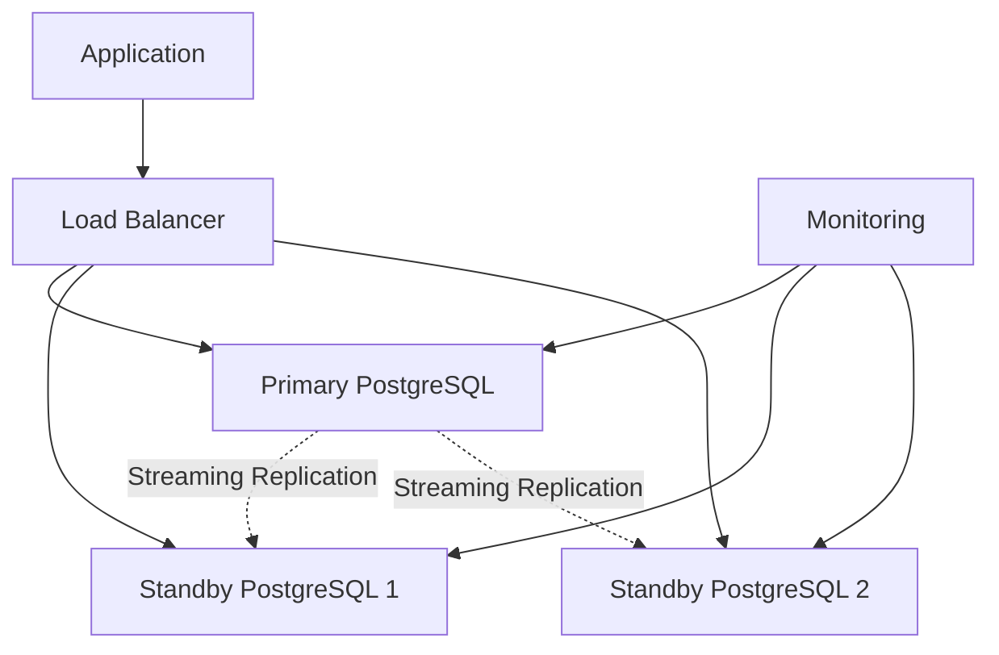

# High Availability

## 🎯 Learning Objectives
By the end of this module, you will:
- Design and implement high availability PostgreSQL architectures
- Configure and manage streaming replication for data redundancy
- Set up load balancing and connection pooling for scalability
- Implement automatic failover mechanisms and disaster recovery
- Monitor cluster health and perform maintenance operations
- Plan and execute zero-downtime deployments and upgrades

## 📚 Table of Contents
1. [High Availability Concepts](#high-availability-concepts)
2. [Streaming Replication](#streaming-replication)
3. [Load Balancing](#load-balancing)
4. [Failover Strategies](#failover-strategies)
5. [Cluster Management](#cluster-management)
6. [Connection Pooling](#connection-pooling)
7. [Zero-Downtime Operations](#zero-downtime-operations)
8. [Monitoring and Alerting](#monitoring-and-alerting)
9. [Hands-On Exercises](#hands-on-exercises)
10. [Best Practices](#best-practices)
11. [Next Steps](#next-steps)

---

## High Availability Concepts

### Understanding High Availability

High Availability (HA) ensures that your PostgreSQL database remains accessible and operational with minimal downtime, even in the face of hardware failures, software issues, or maintenance activities.

#### Key Metrics
- **RTO (Recovery Time Objective)**: Maximum acceptable downtime
- **RPO (Recovery Point Objective)**: Maximum acceptable data loss
- **Availability**: Percentage of uptime (99.9% = 8.76 hours downtime/year)

#### Common HA Architectures



### HA Components

#### Essential Components
1. **Primary Server**: Main database accepting writes
2. **Standby Servers**: Replica databases for reads and failover
3. **Load Balancer**: Distributes traffic and handles failover
4. **Monitoring System**: Detects failures and triggers responses
5. **Backup System**: Regular backups for disaster recovery

---

## Streaming Replication

### Setting Up Streaming Replication

#### Primary Server Configuration

```bash
# Edit postgresql.conf on primary
sudo nano /etc/postgresql/15/main/postgresql.conf
```

```ini
# Replication settings
wal_level = replica
max_wal_senders = 5
max_replication_slots = 5
synchronous_commit = on
archive_mode = on
archive_command = 'cp %p /var/lib/postgresql/archive/%f'

# Connection settings
listen_addresses = '*'
port = 5432
max_connections = 100
```

```bash
# Edit pg_hba.conf for replication access
sudo nano /etc/postgresql/15/main/pg_hba.conf
```

```ini
# Replication connections
host replication replicator 192.168.1.0/24 md5
host replication replicator 10.0.0.0/8 md5
```

#### Create Replication User

```sql
-- Create replication user on primary
CREATE USER replicator WITH REPLICATION ENCRYPTED PASSWORD 'secure_password';

-- Grant necessary permissions
ALTER USER replicator CONNECTION LIMIT 5;
```

#### Standby Server Setup

```bash
# Stop PostgreSQL on standby
sudo systemctl stop postgresql

# Remove existing data directory
sudo rm -rf /var/lib/postgresql/15/main/*

# Create base backup from primary
sudo -u postgres pg_basebackup \
    -h 192.168.1.10 \
    -D /var/lib/postgresql/15/main \
    -U replicator \
    -v -P -W -R

# Start PostgreSQL on standby
sudo systemctl start postgresql
```

#### Standby Configuration

```bash
# Create standby.signal file
sudo -u postgres touch /var/lib/postgresql/15/main/standby.signal

# Configure postgresql.conf on standby
sudo nano /etc/postgresql/15/main/postgresql.conf
```

```ini
# Standby-specific settings
primary_conninfo = 'host=192.168.1.10 port=5432 user=replicator password=secure_password'
primary_slot_name = 'standby_slot'
hot_standby = on
max_standby_streaming_delay = 30s
hot_standby_feedback = on
```

### Synchronous Replication

#### Configure Synchronous Standby

```sql
-- On primary server
ALTER SYSTEM SET synchronous_standby_names = 'standby1,standby2';
SELECT pg_reload_conf();

-- Verify synchronous replication
SELECT 
    application_name,
    state,
    sync_state,
    sync_priority
FROM pg_stat_replication;
```

#### Monitor Replication Lag

```sql
-- Check replication status on primary
SELECT 
    client_addr,
    application_name,
    state,
    sent_lsn,
    write_lsn,
    flush_lsn,
    replay_lsn,
    write_lag,
    flush_lag,
    replay_lag
FROM pg_stat_replication;

-- Check recovery status on standby
SELECT 
    pg_is_in_recovery(),
    pg_last_wal_receive_lsn(),
    pg_last_wal_replay_lsn(),
    pg_last_xact_replay_timestamp();
```

---

## Load Balancing

### HAProxy Configuration

#### Install and Configure HAProxy

```bash
# Install HAProxy
sudo apt update
sudo apt install haproxy

# Configure HAProxy
sudo nano /etc/haproxy/haproxy.cfg
```

```ini
global
    daemon
    maxconn 4096
    log stdout local0

defaults
    mode tcp
    timeout connect 5000ms
    timeout client 50000ms
    timeout server 50000ms
    option tcplog

# Frontend for write operations
frontend postgres_write
    bind *:5432
    default_backend postgres_primary

# Frontend for read operations
frontend postgres_read
    bind *:5433
    default_backend postgres_standby

# Backend for primary server (writes)
backend postgres_primary
    option tcp-check
    tcp-check send-binary 00000020
    tcp-check send-binary 00030000
    tcp-check send-binary 757365720000
    tcp-check send-binary 6461746162617365000000
    tcp-check send-binary 00
    tcp-check expect binary 52
    
    server primary 192.168.1.10:5432 check port 5432 inter 5s rise 2 fall 3

# Backend for standby servers (reads)
backend postgres_standby
    balance roundrobin
    option tcp-check
    
    server standby1 192.168.1.11:5432 check port 5432 inter 5s rise 2 fall 3
    server standby2 192.168.1.12:5432 check port 5432 inter 5s rise 2 fall 3
```

### PgBouncer for Connection Pooling

#### Install and Configure PgBouncer

```bash
# Install PgBouncer
sudo apt install pgbouncer

# Configure PgBouncer
sudo nano /etc/pgbouncer/pgbouncer.ini
```

```ini
[databases]
myapp = host=127.0.0.1 port=5432 dbname=myapp
myapp_read = host=127.0.0.1 port=5433 dbname=myapp

[pgbouncer]
listen_addr = *
listen_port = 6432
auth_type = md5
auth_file = /etc/pgbouncer/userlist.txt
admin_users = postgres
stats_users = postgres
pool_mode = transaction
server_reset_query = DISCARD ALL
max_client_conn = 1000
default_pool_size = 25
reserve_pool_size = 5
log_connections = 1
log_disconnections = 1
```

#### Create User Authentication

```bash
# Create userlist.txt
sudo nano /etc/pgbouncer/userlist.txt
```

```
"myapp_user" "md5_encrypted_password"
"postgres" "md5_encrypted_password"
```

---

## Failover Strategies

### Automatic Failover with Patroni

#### Install Patroni

```bash
# Install dependencies
sudo apt install python3-pip python3-venv
pip3 install patroni[etcd]

# Create Patroni configuration
sudo mkdir -p /etc/patroni
sudo nano /etc/patroni/config.yml
```

```yaml
scope: postgres-cluster
name: node1

restapi:
  listen: 0.0.0.0:8008
  connect_address: 192.168.1.10:8008

etcd:
  hosts: 192.168.1.20:2379,192.168.1.21:2379,192.168.1.22:2379

bootstrap:
  dcs:
    ttl: 30
    loop_wait: 10
    retry_timeout: 30
    maximum_lag_on_failover: 1048576
    postgresql:
      use_pg_rewind: true
      use_slots: true
      parameters:
        wal_level: replica
        hot_standby: on
        max_connections: 100
        max_wal_senders: 5
        max_replication_slots: 5
        checkpoint_completion_target: 0.9

  initdb:
    - encoding: UTF8
    - data-checksums

  pg_hba:
    - host replication replicator 192.168.1.0/24 md5
    - host all all 192.168.1.0/24 md5

postgresql:
  listen: 0.0.0.0:5432
  connect_address: 192.168.1.10:5432
  data_dir: /var/lib/postgresql/15/main
  bin_dir: /usr/lib/postgresql/15/bin
  pgpass: /tmp/pgpass
  authentication:
    replication:
      username: replicator
      password: secure_password
    superuser:
      username: postgres
      password: admin_password

tags:
  nofailover: false
  noloadbalance: false
  clonefrom: false
  nosync: false
```

#### Start Patroni Service

```bash
# Create systemd service
sudo nano /etc/systemd/system/patroni.service
```

```ini
[Unit]
Description=Runners to orchestrate a high-availability PostgreSQL
After=syslog.target network.target

[Service]
Type=simple
User=postgres
Group=postgres
ExecStart=/usr/local/bin/patroni /etc/patroni/config.yml
KillMode=process
TimeoutSec=30
Restart=no

[Install]
WantedBy=multi-user.target
```

```bash
# Enable and start Patroni
sudo systemctl enable patroni
sudo systemctl start patroni

# Check cluster status
patronictl -c /etc/patroni/config.yml list
```

### Manual Failover Procedures

#### Planned Failover

```bash
# Switch primary to standby1
patronictl -c /etc/patroni/config.yml switchover

# Or specify target
patronictl -c /etc/patroni/config.yml switchover --master node1 --candidate node2
```

#### Emergency Failover

```sql
-- Promote standby to primary (if Patroni unavailable)
SELECT pg_promote();

-- Update connection strings in applications
-- Reconfigure load balancer to point to new primary
```

---

## Cluster Management

### Cluster Monitoring

#### Health Check Scripts

```bash
#!/bin/bash
# cluster_health_check.sh

ETCD_ENDPOINTS="192.168.1.20:2379,192.168.1.21:2379,192.168.1.22:2379"
CLUSTER_NAME="postgres-cluster"

echo "=== Cluster Health Check ==="
echo "Date: $(date)"
echo ""

# Check Patroni cluster status
echo "=== Patroni Cluster Status ==="
patronictl -c /etc/patroni/config.yml list

echo ""
echo "=== PostgreSQL Replication Status ==="
psql -h localhost -U postgres -c "
SELECT 
    application_name,
    client_addr,
    state,
    sync_state,
    write_lag,
    flush_lag,
    replay_lag
FROM pg_stat_replication;
"

echo ""
echo "=== Database Connectivity Test ==="
for node in node1 node2 node3; do
    echo -n "Testing $node: "
    if psql -h $node -U postgres -c "SELECT 1" >/dev/null 2>&1; then
        echo "OK"
    else
        echo "FAILED"
    fi
done
```

#### Cluster Maintenance

```bash
# Restart cluster member
patronictl -c /etc/patroni/config.yml restart postgres-cluster node1

# Reload configuration
patronictl -c /etc/patroni/config.yml reload postgres-cluster

# Pause/unpause cluster
patronictl -c /etc/patroni/config.yml pause
patronictl -c /etc/patroni/config.yml resume
```

### Node Management

#### Adding New Standby

```bash
# Prepare new node
sudo apt install postgresql-15

# Stop PostgreSQL
sudo systemctl stop postgresql

# Configure Patroni on new node
sudo nano /etc/patroni/config.yml
```

```yaml
# Update node-specific settings
name: node3
restapi:
  connect_address: 192.168.1.13:8008
postgresql:
  connect_address: 192.168.1.13:5432
```

```bash
# Start Patroni - it will automatically bootstrap from primary
sudo systemctl start patroni
```

#### Removing Node

```bash
# Remove from cluster
patronictl -c /etc/patroni/config.yml remove postgres-cluster node3

# Confirm removal
patronictl -c /etc/patroni/config.yml list
```

---

## Connection Pooling

### Advanced PgBouncer Configuration

#### Multi-Database Setup

```ini
[databases]
# Production databases
prod_app = host=192.168.1.10 port=5432 dbname=app_prod pool_size=30
prod_analytics = host=192.168.1.11 port=5432 dbname=analytics pool_size=10

# Read-only replicas
readonly_app = host=192.168.1.11 port=5432 dbname=app_prod pool_size=20
readonly_analytics = host=192.168.1.12 port=5432 dbname=analytics pool_size=15

[pgbouncer]
listen_addr = *
listen_port = 6432
auth_type = md5
auth_file = /etc/pgbouncer/userlist.txt

# Pool settings
pool_mode = transaction
default_pool_size = 25
min_pool_size = 5
reserve_pool_size = 5
max_client_conn = 1000
max_db_connections = 100

# Timeouts
server_round_robin = 1
query_timeout = 30
query_wait_timeout = 120
client_idle_timeout = 0
server_idle_timeout = 600
server_lifetime = 3600

# Health checks
server_check_delay = 30
server_check_query = SELECT 1

# Logging
log_connections = 1
log_disconnections = 1
log_pooler_errors = 1
```

#### Connection Monitoring

```sql
-- Monitor PgBouncer statistics
SHOW STATS;
SHOW POOLS;
SHOW CLIENTS;
SHOW SERVERS;

-- Check for connection bottlenecks
SHOW LISTS;
```

---

## Zero-Downtime Operations

### Rolling Updates

#### PostgreSQL Minor Version Update

```bash
#!/bin/bash
# rolling_update.sh

NODES=("node1" "node2" "node3")
PRIMARY_NODE="node1"

echo "Starting rolling update..."

# Update standby nodes first
for node in "${NODES[@]}"; do
    if [ "$node" != "$PRIMARY_NODE" ]; then
        echo "Updating $node..."
        
        # Pause node in Patroni
        patronictl -c /etc/patroni/config.yml pause --wait
        
        # Update PostgreSQL
        ssh $node "sudo apt update && sudo apt upgrade postgresql-15"
        
        # Resume node
        patronictl -c /etc/patroni/config.yml resume
        
        # Wait for node to be healthy
        sleep 30
    fi
done

# Switchover to updated standby
echo "Switching primary to updated standby..."
patronictl -c /etc/patroni/config.yml switchover --master $PRIMARY_NODE

# Update original primary
echo "Updating original primary..."
ssh $PRIMARY_NODE "sudo apt update && sudo apt upgrade postgresql-15"

echo "Rolling update completed successfully!"
```

#### Configuration Changes

```sql
-- Apply configuration changes without restart
ALTER SYSTEM SET shared_preload_libraries = 'pg_stat_statements';
SELECT pg_reload_conf();

-- For settings requiring restart, use rolling restart
-- Restart standby nodes first, then failover
```

---

## Monitoring and Alerting

### Comprehensive Monitoring Setup

#### Prometheus Configuration

```yaml
# postgresql-exporter.yml
global:
  scrape_interval: 15s

rule_files:
  - "postgres_rules.yml"

scrape_configs:
  - job_name: 'postgresql'
    static_configs:
      - targets: 
        - 'node1:9187'
        - 'node2:9187'
        - 'node3:9187'
    scrape_interval: 10s
    metrics_path: /metrics

  - job_name: 'patroni'
    static_configs:
      - targets:
        - 'node1:8008'
        - 'node2:8008'
        - 'node3:8008'
    scrape_interval: 10s
    metrics_path: /metrics
```

#### Alert Rules

```yaml
# postgres_rules.yml
groups:
  - name: postgresql.rules
    rules:
      - alert: PostgreSQLDown
        expr: pg_up == 0
        for: 1m
        labels:
          severity: critical
        annotations:
          summary: "PostgreSQL is down"
          description: "PostgreSQL instance {{ $labels.instance }} is down"

      - alert: PostgreSQLReplicationLag
        expr: pg_replication_lag_seconds > 30
        for: 2m
        labels:
          severity: warning
        annotations:
          summary: "High replication lag"
          description: "Replication lag is {{ $value }} seconds on {{ $labels.instance }}"

      - alert: PostgreSQLConnectionsHigh
        expr: pg_stat_database_numbackends / pg_settings_max_connections > 0.8
        for: 5m
        labels:
          severity: warning
        annotations:
          summary: "High connection usage"
          description: "Connection usage is {{ $value | humanizePercentage }} on {{ $labels.instance }}"

      - alert: PatroniClusterUnhealthy
        expr: patroni_cluster_unlocked == 1
        for: 1m
        labels:
          severity: critical
        annotations:
          summary: "Patroni cluster is unlocked"
          description: "Patroni cluster has no leader"
```

#### Grafana Dashboard

```json
{
  "dashboard": {
    "title": "PostgreSQL High Availability",
    "panels": [
      {
        "title": "Cluster Status",
        "type": "stat",
        "targets": [
          {
            "expr": "patroni_master",
            "legendFormat": "Master Node"
          }
        ]
      },
      {
        "title": "Replication Lag",
        "type": "graph",
        "targets": [
          {
            "expr": "pg_replication_lag_seconds",
            "legendFormat": "{{ instance }}"
          }
        ]
      },
      {
        "title": "Connection Count",
        "type": "graph",
        "targets": [
          {
            "expr": "pg_stat_database_numbackends",
            "legendFormat": "{{ instance }}"
          }
        ]
      }
    ]
  }
}
```

---

## Hands-On Exercises

### Exercise 1: Basic Streaming Replication

**Objective**: Set up a primary-standby replication pair

**Steps**:
1. Configure primary server for replication
2. Create base backup and set up standby
3. Verify replication is working
4. Test read queries on standby

**Verification**:
```sql
-- On primary
SELECT client_addr, state, sync_state FROM pg_stat_replication;

-- On standby
SELECT pg_is_in_recovery(), pg_last_wal_replay_timestamp();
```

### Exercise 2: HAProxy Load Balancing

**Objective**: Configure load balancing for read/write splitting

**Steps**:
1. Install and configure HAProxy
2. Set up health checks
3. Test write operations go to primary
4. Test read operations are distributed

**Verification**:
```bash
# Test write connection
psql -h haproxy_host -p 5432 -c "CREATE TABLE test_write(id int);"

# Test read connections
for i in {1..10}; do
  psql -h haproxy_host -p 5433 -c "SELECT inet_server_addr();"
done
```

### Exercise 3: Automatic Failover with Patroni

**Objective**: Implement automatic failover

**Steps**:
1. Set up etcd cluster
2. Configure Patroni on all nodes
3. Test automatic failover
4. Verify data consistency

**Verification**:
```bash
# Check cluster status
patronictl list

# Simulate primary failure
sudo systemctl stop postgresql

# Verify new primary is elected
patronictl list
```

---

## Best Practices

### Architecture Design

#### Best Practices
1. **Use odd number of nodes** for consensus-based solutions
2. **Separate read and write workloads** using load balancing
3. **Monitor replication lag** and set appropriate alerts
4. **Plan for network partitions** and split-brain scenarios
5. **Regular disaster recovery testing** to validate procedures

#### Anti-Patterns
- Single point of failure in load balancer
- Synchronous replication without considering latency
- Manual failover procedures without automation
- Insufficient monitoring and alerting
- No backup strategy for HA metadata

### Performance Considerations

#### Optimization Tips
```sql
-- Optimize for replication performance
ALTER SYSTEM SET wal_compression = on;
ALTER SYSTEM SET max_wal_size = '2GB';
ALTER SYSTEM SET min_wal_size = '512MB';

-- Standby query optimization
ALTER SYSTEM SET hot_standby_feedback = on;
ALTER SYSTEM SET max_standby_streaming_delay = '30s';
```

#### Network Optimization
```bash
# Optimize network for replication
echo 'net.core.rmem_max = 16777216' >> /etc/sysctl.conf
echo 'net.core.wmem_max = 16777216' >> /etc/sysctl.conf
echo 'net.ipv4.tcp_rmem = 4096 65536 16777216' >> /etc/sysctl.conf
echo 'net.ipv4.tcp_wmem = 4096 65536 16777216' >> /etc/sysctl.conf
sysctl -p
```

### Security Considerations

#### Replication Security
```bash
# Use SSL for replication
echo "hostssl replication replicator 192.168.1.0/24 cert" >> pg_hba.conf

# Certificate-based authentication
openssl req -new -x509 -days 365 -nodes -text \
  -out server.crt -keyout server.key -subj "/CN=postgres"
```

#### Network Security
```bash
# Firewall rules for PostgreSQL cluster
ufw allow from 192.168.1.0/24 to any port 5432
ufw allow from 192.168.1.0/24 to any port 8008  # Patroni
ufw allow from 192.168.1.0/24 to any port 2379  # etcd
```

---

## Next Steps

### Advanced Topics to Explore
1. **Multi-Region Deployments** - Cross-datacenter replication
2. **Kubernetes Integration** - PostgreSQL operators and StatefulSets
3. **Cloud-Native Solutions** - AWS RDS, Google Cloud SQL, Azure Database
4. **Performance at Scale** - Sharding and partitioning strategies
5. **Backup Integration** - Point-in-time recovery in HA environments

### Recommended Reading
- [PostgreSQL High Availability Cookbook](https://www.postgresql.org/docs/current/high-availability.html)
- [Patroni Documentation](https://patroni.readthedocs.io/)
- [HAProxy Configuration Manual](http://cbonte.github.io/haproxy-dconv/)

### Community Resources
- PostgreSQL Slack - #high-availability channel
- Patroni GitHub Issues and Discussions
- PostgreSQL Weekly Newsletter

---

## Summary

In this module, you've learned to:
- ✅ Design high availability PostgreSQL architectures
- ✅ Implement streaming replication and load balancing
- ✅ Configure automatic failover with Patroni
- ✅ Manage PostgreSQL clusters effectively
- ✅ Perform zero-downtime operations and updates
- ✅ Monitor cluster health and performance

You're now equipped to build and maintain enterprise-grade PostgreSQL high availability solutions that can handle production workloads with minimal downtime and optimal performance.

**Continue to**: [Administration and Monitoring](15-administration-monitoring.md) to master PostgreSQL administration and monitoring techniques.
